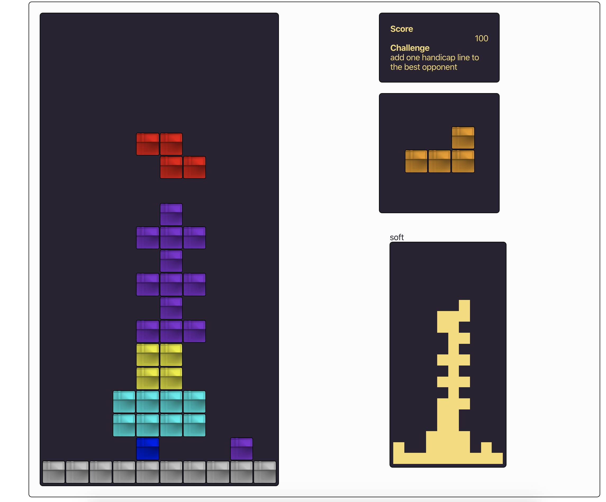

# Red Tetris Boilerplate

This starter kit was made to help students to develop red_tetris project : a Full Stack Javascript Tetris. We can also use it as a starting point for any product made of React / Redux and socket.io.

It helps:

* to transpile with Babel ES6 code
* to bundle with Wbepack JS files and hot reload client's code
* to write tests and check code coverage. 

Because we use React, Redux, Node.js and Socket.io, we had to define 3 kinds of unit tests :

* React ones like explained in redux documentation + `chai-equal-jsx`
* Redux ones, but instead of just testing pure functions, we defined a middleware to test state’s impact after one or many actions.
* Redux/Socket.io/Node.js, same as before, we use the same middleware but this time we can test state’s updates after socketio messages round trip.

### Install

Install [node](https://nodejs.org/en/) first. After that:

```
$ npm install
```

Edit `params.js` for your needs.


### Development Mode

#### Launch Application

```
$ npm start
[1] > red_tetrisboilerplate@0.0.1 client-dev /Users/matthieu/Projet/react/BluePong
[1] > NODE_ENV=development node scripts/start.js
[1]
[2]
[2] > red_tetrisboilerplate@0.0.1 srv-dev /Users/matthieu/Projet/react/BluePong
[2] > NODE_ENV=development nodemon --watch src/server --exec babel-node src/server/main.js
[2]
[0]
[0] > red_tetrisboilerplate@0.0.1 api-dev /Users/matthieu/Projet/react/BluePong
[0] > NODE_ENV=development nodemon --watch src/api --exec babel-node src/api/main.js
```

Point your browser to `http://localhost:8080/` it will load client side application.

URL is editable in `params.js`.

As you can guess we are using webpack `hot reload` module, try to update any file under `src/client` and your browser should reload your code.

```
[WDS] App updated. Recompiling...
```


#### Test

Test, test and re-test …

```
$ npm run test
```

### Images
