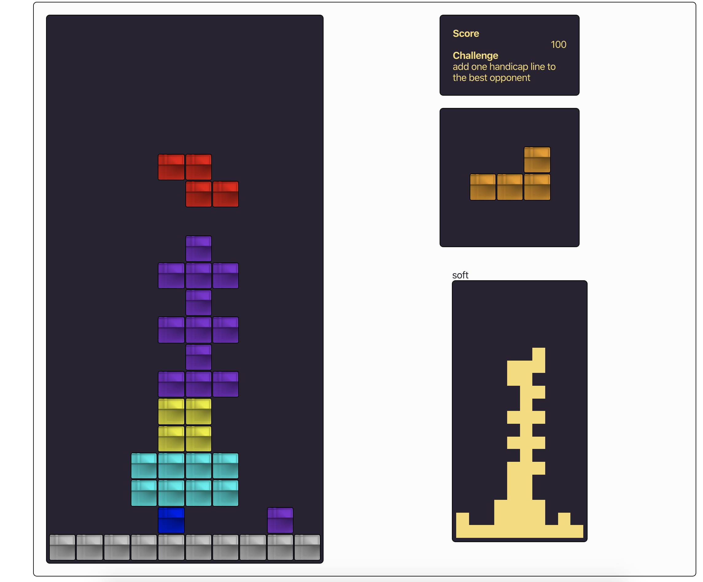
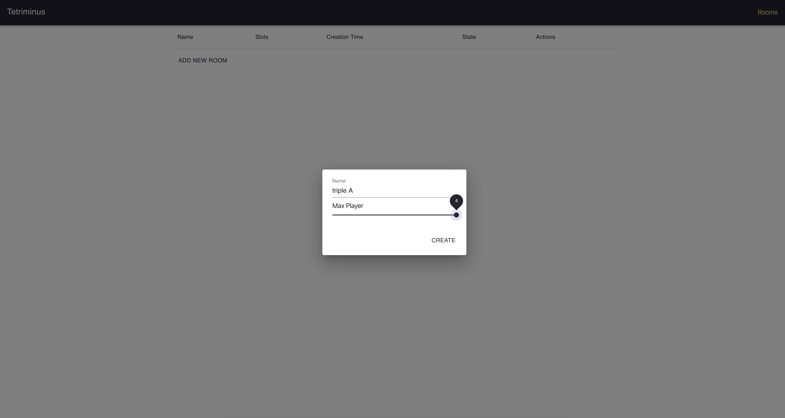
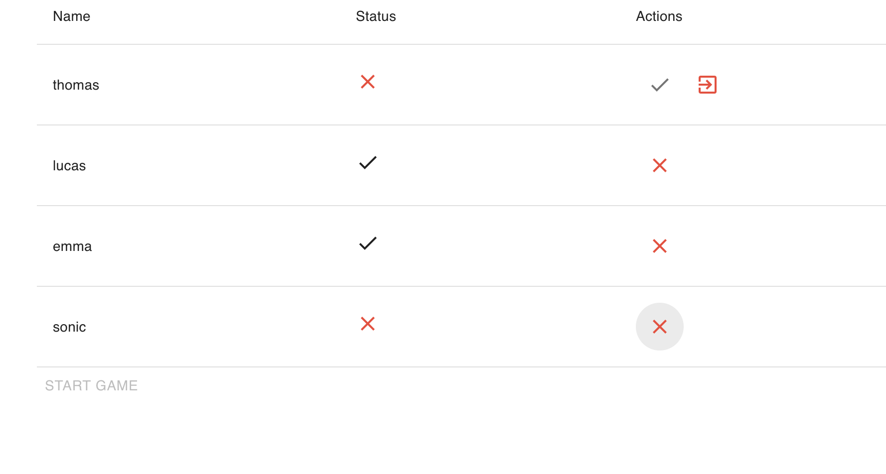
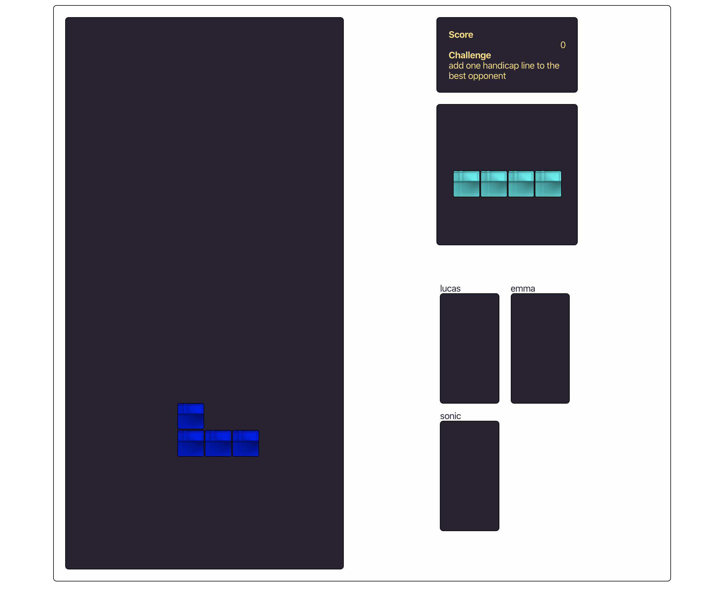

# Red Tetris Boilerplate

This starter kit was made to help students to develop red_tetris project : a Full Stack Javascript Tetris. We can also use it as a starting point for any product made of React / Redux and socket.io.

### Install

Install [node](https://nodejs.org/en/) first. After that:

```
$ npm install
```

Edit `params.js` for your needs.


### Development Mode

#### Launch Application

```
$ npm start
[1] > red_tetrisboilerplate@0.0.1 client-dev /Users/matthieu/Projet/react/BluePong
[1] > NODE_ENV=development node scripts/start.js
[1]
[2]
[2] > red_tetrisboilerplate@0.0.1 srv-dev /Users/matthieu/Projet/react/BluePong
[2] > NODE_ENV=development nodemon --watch src/server --exec babel-node src/server/main.js
[2]
[0]
[0] > red_tetrisboilerplate@0.0.1 api-dev /Users/matthieu/Projet/react/BluePong
[0] > NODE_ENV=development nodemon --watch src/api --exec babel-node src/api/main.js
```

Point your browser to `http://localhost:8080/` it will load client side application.

URL is editable in `params.js`.

As you can guess we are using webpack `hot reload` module, try to update any file under `src/client` and your browser should reload your code.

```
[WDS] App updated. Recompiling...
```


#### Test

Test, test and re-test …

```
$ npm run test
```

## How To Use

### Lobby

You need to choose a name.

After that you can join or create a room, to start to play.

### In a room

You can set ready or not. leave the room... Or if you are the Room's Master you can start the game if everybody is ready. Or he can kick poeple if he want.

### In game

It's a Tetris multiplayer

Keyboard :

```
UP    : rotate the piece
DOWN  : move the piece down
LEFT  : move the piece left
RIGHT : move the piece right
SPACE : drop the piece
Z     : change to left power
X     : change to right power
```
the power proc for each line you do.

### Images



